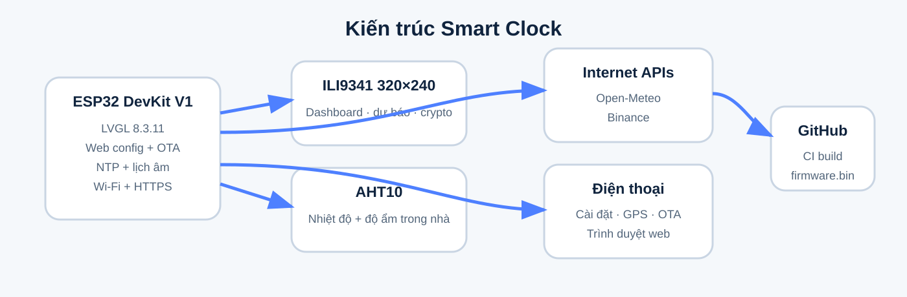
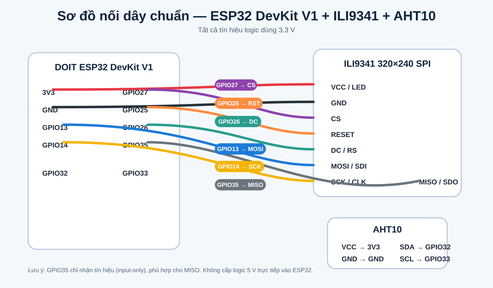

# ESP32 DevKit V1 + ILI9341 Smart Clock

Smart Clock 320×240 dành cho **DOIT ESP32 DevKit V1 (classic ESP32)**, màn hình **ILI9341 SPI** và cảm biến **AHT10**. Firmware dùng LVGL để hiển thị đồng hồ, lịch âm, thời tiết, dự báo 7 ngày, crypto, dữ liệu cảm biến, web setting và OTA.

> **Target chính thức:** DOIT ESP32 DevKit V1. Repo này không dành cho ESP32-C3/S2/S3 nếu chưa đổi lại pin và board target.

<p align="center">
  
</p>

## Sơ đồ nối dây

<p align="center">
  
</p>

### ILI9341 → ESP32 DevKit V1

| ILI9341 | ESP32 DevKit V1 | Ghi chú |
|---|---:|---|
| VCC | 3V3 | Nguồn 3.3 V |
| GND | GND | Mass chung |
| CS | GPIO27 | Chip Select |
| RESET / RST | GPIO25 | Reset màn hình |
| DC / RS | GPIO26 | Data / Command |
| MOSI / SDI | GPIO13 | HSPI MOSI |
| SCK / CLK | GPIO14 | HSPI Clock |
| MISO / SDO | GPIO35 | HSPI MISO, GPIO35 là input-only |
| LED / BL | 3V3 | Theo module; ưu tiên 3.3 V |

### AHT10 → ESP32 DevKit V1

| AHT10 | ESP32 DevKit V1 |
|---|---:|
| VCC | 3V3 |
| GND | GND |
| SDA | GPIO32 |
| SCL | GPIO33 |

**Không đưa tín hiệu logic 5 V trực tiếp vào GPIO ESP32.**

## Tính năng

- Đồng hồ NTP, múi giờ cấu hình được.
- Lịch dương + lịch âm Việt Nam.
- Thời tiết hiện tại và dự báo 7 ngày từ Open‑Meteo.
- GPS từ điện thoại qua trang HTTPS bridge.
- Theo dõi tối đa 3 mã crypto qua Binance.
- Nhiệt độ / độ ẩm trong nhà từ AHT10.
- Nhiều trang TFT và tự động chuyển trang.
- Web setting trên ESP32.
- Quét Wi‑Fi từ giao diện web.
- OTA bằng file `.bin` hoặc URL GitHub trực tiếp.
- GitHub Actions tự build `firmware.bin` và tạo Release.

## Cấu hình phần mềm

### Arduino IDE

- **Board:** `DOIT ESP32 DEVKIT V1`
- **Flash size:** 4 MB
- **Partition:** dùng file `partitions.csv` đi kèm repo (2 OTA slot ~1.875 MB mỗi slot)
- **Serial:** 115200 baud

### Thư viện

Workflow CI cài các thư viện sau:

- LVGL **8.3.11**
- Adafruit GFX Library
- Adafruit ILI9341
- Adafruit AHTX0
- ArduinoJson

File `lv_conf.h` của repo đặt `LV_COLOR_DEPTH = 16` và bộ nhớ LVGL 48 KB.

## Cài đặt lần đầu

Firmware **không còn chứa sẵn SSID/mật khẩu Wi‑Fi cá nhân**.

Nếu chưa có Wi‑Fi lưu trong Preferences hoặc kết nối thất bại, ESP32 tạo AP:

- **SSID:** `ESP32-SmartClock`
- **Password:** `12345678`
- **Trang cài đặt:** `http://192.168.4.1`

Sau khi lưu Wi‑Fi, board khởi động lại và kết nối router. Khi đã online, trang setting cũng truy cập được qua IP LAN in trên Serial Monitor.

## Build firmware

Clone repo rồi mở sketch:

`ESP32_ILI9341_AHT10_Pro.ino`

Các file font `ui_font_*.c` và `lv_conf.h` phải được giữ cùng project theo cấu trúc hiện tại.

GitHub Actions build bằng target:

`esp32:esp32:esp32doit-devkit-v1`

Repo có `partitions.csv` riêng cho flash 4 MB, gồm 2 app OTA slot khoảng 1.875 MB, 128 KB SPIFFS và 64 KB coredump. Cách này tránh phụ thuộc menu partition của từng phiên bản board package.

Mỗi lần push thay đổi firmware lên `main`, workflow tạo artifact và GitHub Release chứa `firmware.bin`.

## OTA

### Upload file .bin

Trong web setting chọn firmware `.bin` và upload. ESP32 ghi firmware bằng `Update` rồi tự reboot.

### Update từ GitHub

Trang setting cũng nhận URL HTTPS trỏ trực tiếp tới file `.bin` trên GitHub. Không tắt nguồn trong lúc cập nhật.

## GPS điện thoại

Trình duyệt HTTP nội bộ không phải secure context nên không phải lúc nào cũng được phép truy cập GPS. Firmware chuyển sang:

`https://raw.githack.com/ledinhtien219/ESP32C3-ILI9341/main/gps.html`

Trang HTTPS xin quyền GPS rồi chuyển tọa độ về endpoint `/gps-apply` của ESP32.

## Cấu trúc repo

```text
.
├── ESP32_ILI9341_AHT10_Pro.ino
├── lv_conf.h
├── partitions.csv
├── gps.html
├── ui_font_*.c
├── docs/
│   ├── project-overview.svg
│   └── wiring-esp32-devkit-v1-ili9341.svg
└── .github/workflows/build-firmware.yml
```

## Kiểm tra nhanh khi gặp lỗi

- **Màn hình trắng:** kiểm tra CS 27, RST 25, DC 26, MOSI 13, SCK 14 và nguồn 3.3 V.
- **Màu/ảnh sai:** đảm bảo dùng ILI9341 320×240 và đúng rotation trong firmware.
- **Không thấy AHT10:** kiểm tra SDA 32 / SCL 33.
- **Không vào Wi‑Fi:** xóa cấu hình cũ hoặc chờ AP `ESP32-SmartClock` xuất hiện.
- **Không có thời tiết:** kiểm tra ESP32 đã có Internet và vị trí/tọa độ hợp lệ.
- **OTA không đủ bộ nhớ:** đảm bảo `partitions.csv` nằm cùng sketch và không bị Arduino IDE bỏ qua.

## Release

Firmware build tự động nằm trong mục **Releases** của repository dưới tên `firmware.bin`.
